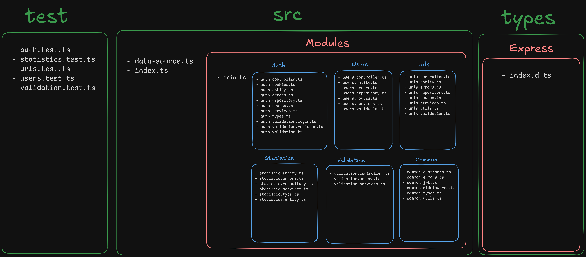

# Table of Contents

1.  [Table of contents](#org791f3d9)
2.  [File Structure](#file-structure)

This is the backend for the **shrt-link** project, a link shortener created for learning purposes.

Some of the technologies used are:

-   Express
-   PostgreSQL
-   JSON Web Token
-   TypeORM
-   Redis (planned for future implementation)

The project is still in development and has room to mature, but for now, it is functioning quite well.

# Table of contents

-   [File Structure](#file-structure)
-   [Usage](usage.md)
    -   [Requirements](usage.md)
    -   [Running the Project](usage.md)
    -   [Auth](usage.md)
    -   [Users](usage.md)
    -   [Urls](usage.md)
-   [Authorization](auth.md)
    -   [Validation middlewares](auth.md)
-   [Routes](routes/index.md)
    -   [Main](routes/main.md)
    -   [User](routes/users.md)
    -   [Auth](routes/auth.md)
    -   [Url](routes/urls.md)
-   [Types](types.md)
    -   [Custom Request](types.md)
    -   [Custom types](types.md)
-   [Tests](tests.md)
    -   [Auth Tests](tests.md)
    -   [User Tests](tests.md)
    -   [Url Tests](tests.md)
    -   [Validation Tests](tests.md)
-   [Cookies](cookies.md)

# File Structure

